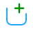
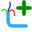
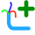

# Cable Connection Icons Preview

Этот документ содержит превью всех созданных иконок для управления подключениями кабелей.

## Набор 1: Cable + Plus (Добавление подключения)

Кабель: `#20A8FF` | Плюс: `#008C00`

| 16px | 24px | 32px | 40px | 48px |
|------|------|------|------|------|
|  |  |  |  |  |

**Файлы:**
- `cable_add_connection_16.svg` - минимальная толщина линий
- `cable_add_connection_24.svg`
- `cable_add_connection_32.svg`
- `cable_add_connection_40.svg`
- `cable_add_connection_48.svg` - максимальная толщина линий

---

## Набор 2: Cable + Minus (Удаление подключения)

Кабель: `#20A8FF` | Минус: `#BE0000`

| 16px | 24px | 32px | 40px | 48px |
|------|------|------|------|------|
|  |  |  |  |  |

**Файлы:**
- `cable_remove_connection_16.svg` - минимальная толщина линий
- `cable_remove_connection_24.svg`
- `cable_remove_connection_32.svg`
- `cable_remove_connection_40.svg`
- `cable_remove_connection_48.svg` - максимальная толщина линий

---

## Набор 3: Cable + Grid Cell (Менеджер подключений)

Кабель: `#20A8FF` | Ячейка: `#20A8FF` (без заливки)

| 16px | 24px | 32px | 40px | 48px |
|------|------|------|------|------|
|  |  |  |  |  |

**Файлы:**
- `cable_connection_manager_16.svg` - минимальная толщина линий
- `cable_connection_manager_24.svg`
- `cable_connection_manager_32.svg`
- `cable_connection_manager_40.svg`
- `cable_connection_manager_48.svg` - максимальная толщина линий

---

## Технические характеристики

- **Размер холста:** 48x48 пикселей для всех иконок
- **Формат:** SVG (векторный)
- **Стиль кабеля:** U-образная змейка (как в примере)
- **Варианты толщины:** 5 вариантов для каждого типа иконки
- **Расположение:** `cad_source/images/zelectro/`

## Использованные цвета

- Кабель (змейка): `#20A8FF` - голубой
- Символ "Плюс": `#008C00` - зеленый
- Символ "Минус": `#BE0000` - красный
- Символ "Ячейка": `#20A8FF` - голубой (контур без заливки)

Все иконки созданы с использованием закругленных концов линий (`stroke-linecap:round`) для более плавного и современного вида.
