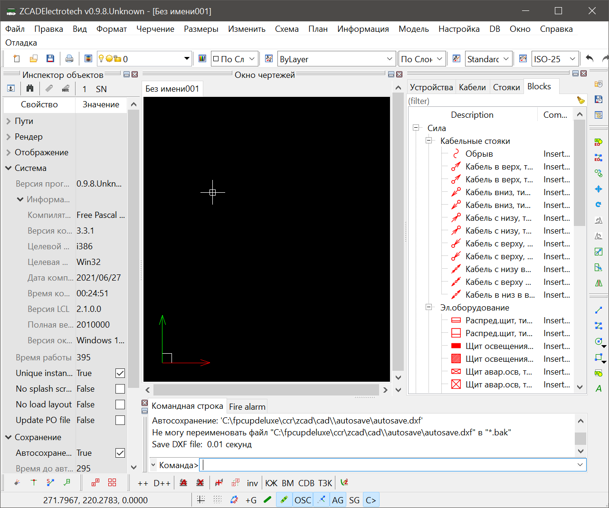

### Интерфейс пользователя
Интерфейс программы представлен на рисунке:

[[zcad_ui]]
.Внешний вид окна программы

.1. Окно отображения
Тут производится отображение и редактирование графической информации. Редактирование производится курсором, его форма зависит от ожидаемого действия: перекрестие - указание точки на чертеже, прямоугольник - выбор графического примитива

.2. Инспектор объектов
Тут отображаются и редактируются свойства различных сущностей. По умолчанию в нем отображаются настройки программы, но в зависимости от ситуации могут отображаться например свойства выделенных примитивов или параметры запущеной команды.

На рис. <<zcad_ui>> в инспекторе отображаются настройки программы. Если в области отображения выделить несколько примитивов, инспектор примет примерно следующий вид:

.Свойства выделенных примитивов
image::images/object_inspector.png[width=25%]

Имена свойств доступных только для чтения отображаются серым цветом. Если выделенные примитивы имеют различные значения одноименных свойств, данные значения отображаются как "Разный".  Если данные значения фактически отличаются, но изза настроек отображения !!NEEDLINK!! (округления) выглядят одинаково, данные значения помечаются знаком "≈".

При клике на значение свойства откроется строка редактирования и можно будет изменить значение свойства. Для некоторых свойств доступны специализированные редакторы, открывающиеся в отдельном окне по нажатию кнопки [...]

Свойства примитивов структурированны следующим образом:
[tree,file="images/object_inspector_strucrure.png",width=25%]
--
#Инспектор
#Обрабатывать_примитивы
#Process_variables
#Переменные
##Переменные_примитивов
#Общие
##Основные_свойства_примитивов
#Геометрия
##Геометрические_свойства_примитивов
#Разное
##Не_геометрические_свойства_примитивов
#Суммарно
##FILTER
###Свойства_для_фильтрации
##Просуммированные свойства
--

.. Обрабатывать примитивы - тут можно выбрать тип примитивов свойства которых отображаются в инспекторе, а нажатием кнопок [*] или [-] оставить только примитивы данного типа в текущем выборе или исключить их из текущего выбора

.. Process variables - ЭКСПЕРИМЕНТАЛЬНО !!NEEDLINK!! управляет обработкой переменных, привязанных к примитивам. Only this ents - только переменные выбранных примитивов; Only related ents - только переменные связанных примитивов; All ents - обрабатываются переменные и примитивов из текущего выбора и связанных с ними примитивов 

.. Переменные - на этом уровне структуры будут отображены все доступные в соответствии с значением Process variables переменные. При отображении переменных свзанных примитивов возможна цветовая раскраска значений ЭКСПЕРИМЕНТАЛЬНО !!NEEDLINK!!

.. Общие - тут перечисдены общие свойства примитивов: слой, цвет, вес и т.п.

.. Геометрия - различные геометрические свойства: точки вставки, координаты, длины и т.п.

.. Суммарно - некоторые свойства допускающие суммирование, например при выборе нескольких отрезков тут будет их суммарная длина. Здесь же в ветке FILTER будут некоторые свойства допускающие фильтрацию, например можно кнопкой [*] оставить в текущем выборе тиолько примитивы лежащие на определенном слое.

.3. Окно сообщений
Тут отображается различные сообщения по ходу работы программы. Информация о процессах, сообщения о ошибках, предупреждения, подсказки для пользователя и т.п.

.4. Командная строка
Тут можно ввести имя команды, тем самым запустив ее, либо ввести координату точки на запрос уже выполняемой команды.

Поле ввода имеет подсказку меняющуюся по текущей ситуации. Когда программа ожидает ввода команды подсказка имеет вид `Команда>` и `>` когда ожидается координата.

Перечень доступных комманд приведен в <<command_list>> команда может быть введена как просто по имени, так с операндом. Операнд указывается в скобках после имени команды. Например ввод `Load` вызовет диалог открытия файла чертежа и последующую его загрузку. Ввод `Load(D:\file.dxf)` сразу вызовет загрузку файла D:\file.dxf. Парсинг операндов выполняется силами команды, поэтому синтаксис в разных командах отличается

Координаты можно вводить как 2D, так и 3D, при этом 2D будут переведены в 3D подстановкой 0 в качестве координаты Z. Также можно вводить как абсолютные, так и относительные (относительно последней указанной точки) значения. Относительные координаты задаются указанием знака `@` перед координатой X.

Например если в открытом чертеже на запрос `Команда>` ввести `Line`, затем `10,30`, затем `@1,2` будет построена линия с координатами (10,30)-(11,32)

Командная строка может быть отключена !!NEEDLINK!! В режиме с выключеной командной строкой становятся доступны буквенные хоткеи - с включенной нажатия букв обрабатываются командной строкой

.5. Статусная строка.
Здесь отображаются координаты курсора и прогрессбары долгих процессов. Также есть быстрый доступ к кнопкам переключения различных режимов работы программы !!NEEDLINK!!

.6. Тулбары
Здесь сгруппированы иконки различных комманд для их быстрого запуска. !!NEEDLINK!!

.7. Палитры
Могут отображаться в древовидном виде и в виде списка иконок. К каждому листу дерева или иконке списка может быть привяана произвольная команда, запускаемая при клике по элементу. Как правило это команды втавки устройств или блоков. Древовидные палитры дополнительно оснащены полем фильтра для быстрого нахождения элементов !!NEEDLINK!!

.8. Навигаторы
Навигаторы служат для быстрой навигации по чертежу, нахождению на нем тех или иных элементов. Представляют из себя настраиваимую древовидную структуру отображения данных. На данный момент в программе доступны навигаторы устройств, кабелей, стояков и примитивов

