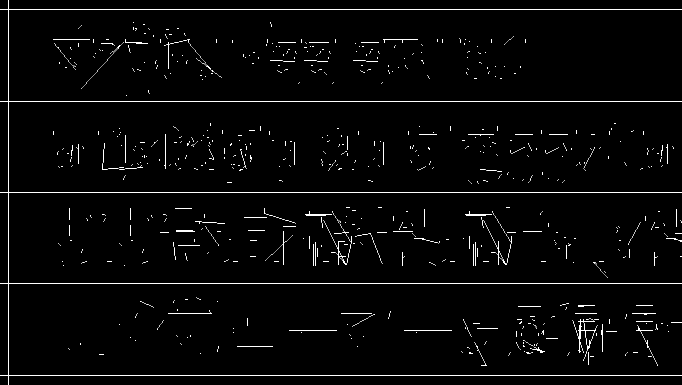
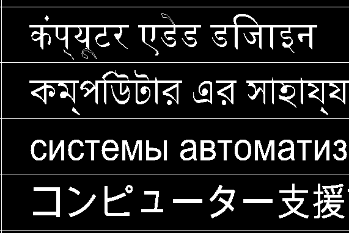

# Issue #279: Исправление рендеринга TTF шрифтов / Fix TTF Font Rendering

## Проблема / Problem

После разделения рендеринга SHX и TTF шрифтов в PR #286, TTF шрифты стали отображаться как набор черточек вместо нормального текста.

After separating SHX and TTF font rendering in PR #286, TTF fonts started displaying as a set of dashes instead of normal text.

### Симптомы / Symptoms

- **SHX шрифты**: Работают корректно (отображаются в правильных позициях)
- **TTF шрифты**: Выглядят как набор несвязанных линий/черточек

- **SHX fonts**: Work correctly (display at correct positions)
- **TTF fonts**: Look like a set of disconnected lines/dashes

### Визуальное подтверждение / Visual Confirmation

**Сломанный вывод / Broken output:**


**Правильный вывод / Correct output:**


## Корневая причина / Root Cause

Проблема была в неправильном определении типа шрифта:

The problem was in incorrect font type detection:

```pascal
// СТАРЫЙ КОД / OLD CODE (НЕПРАВИЛЬНО / INCORRECT)
isSHXFont:=(PExternalVectorObject<>nil) and (ExternalLLPCount>0);
```

### Почему это не работало / Why This Didn't Work

1. **SHX шрифты** имеют `PExternalVectorObject` с векторными примитивами (линиями)
2. **TTF шрифты ТАКЖЕ** имеют `PExternalVectorObject` с треугольниками для рендеринга
3. Проверка `(PExternalVectorObject<>nil)` возвращает `true` для ОБОИХ типов шрифтов!
4. Результат: TTF шрифты ошибочно обрабатывались как SHX и рисовались линиями через `RenderSHXPrimitivesWithGDI`

1. **SHX fonts** have `PExternalVectorObject` with vector primitives (lines)
2. **TTF fonts ALSO** have `PExternalVectorObject` with triangles for rendering
3. The check `(PExternalVectorObject<>nil)` returns `true` for BOTH font types!
4. Result: TTF fonts were mistakenly processed as SHX and drawn as lines via `RenderSHXPrimitivesWithGDI`

### Почему это выглядело как черточки / Why It Looked Like Dashes

Когда TTF глифы (которые представляют собой заполненные треугольники) обрабатывались функцией `RenderSHXPrimitivesWithGDI`:
- Функция пыталась отрисовать их как линии
- Треугольники интерпретировались как отдельные линейные сегменты
- Результат: вместо заполненных символов получались разрозненные черточки

When TTF glyphs (which are filled triangles) were processed by `RenderSHXPrimitivesWithGDI`:
- The function tried to render them as lines
- Triangles were interpreted as separate line segments
- Result: instead of filled characters, we got disconnected dashes

## Решение / Solution

Использовать правильную проверку типа шрифта через RTTI:

Use proper font type checking via RTTI:

```pascal
// НОВЫЙ КОД / NEW CODE (ПРАВИЛЬНО / CORRECT)
isSHXFont:=PGDBfont(PSymbolsParam.pfont)^.font is TZESHXFontImpl;
```

### Как это работает / How This Works

1. `PSymbolsParam.pfont` - указатель на структуру `PGDBfont`
2. `PGDBfont(...)^.font` - поле типа `TZEBaseFontImpl` (базовый класс)
3. Оператор `is TZESHXFontImpl` - проверка времени выполнения (RTTI)
4. Возвращает `true` ТОЛЬКО для SHX шрифтов, `false` для TTF шрифтов

1. `PSymbolsParam.pfont` - pointer to `PGDBfont` structure
2. `PGDBfont(...)^.font` - field of type `TZEBaseFontImpl` (base class)
3. `is TZESHXFontImpl` operator - runtime type checking (RTTI)
4. Returns `true` ONLY for SHX fonts, `false` for TTF fonts

### Дополнительная защита / Additional Safety

Также добавлена проверка наличия векторных данных:

Also added check for vector data presence:

```pascal
if isSHXFont and (PExternalVectorObject<>nil) and (ExternalLLPCount>0) then
```

Это гарантирует, что:
- Шрифт действительно является SHX (по типу)
- И имеет векторные данные для отрисовки

This ensures that:
- Font is actually SHX (by type)
- And has vector data to render

## Изменения в коде / Code Changes

### Файл / File: `cad_source/zengine/zgl/gdi/uzgldrawergdi.pas`

1. **Добавлен импорт / Added import** (строка/line 41):
   ```pascal
   uzeconsts,uzefontshx;
   ```

2. **Исправлена проверка типа шрифта / Fixed font type check** (строка/line 605):
   ```pascal
   isSHXFont:=PGDBfont(PSymbolsParam.pfont)^.font is TZESHXFontImpl;
   ```

3. **Усилена проверка перед рендерингом SHX / Strengthened check before SHX rendering** (строка/line 666):
   ```pascal
   if isSHXFont and (PExternalVectorObject<>nil) and (ExternalLLPCount>0) then
   ```

## Результат / Result

- ✅ **TTF шрифты** теперь правильно рендерятся через `ExtTextOut` с трансформацией контекста GDI
- ✅ **SHX шрифты** продолжают рендериться через векторные примитивы GDI
- ✅ Оба типа шрифтов отображаются корректно

- ✅ **TTF fonts** now render correctly via `ExtTextOut` with GDI context transformation
- ✅ **SHX fonts** continue to render via GDI vector primitives
- ✅ Both font types display correctly

## Тестирование / Testing

Необходимо протестировать:
1. Отображение TTF шрифтов (должны быть читаемыми и правильно позиционированными)
2. Отображение SHX шрифтов (должны быть правильно позиционированными, не группироваться у начала координат)
3. Различные углы поворота, масштабы, углы наклона
4. Разные уровни зума

Need to test:
1. TTF font display (should be readable and correctly positioned)
2. SHX font display (should be correctly positioned, not clustering at origin)
3. Various rotation angles, scales, oblique angles
4. Different zoom levels
